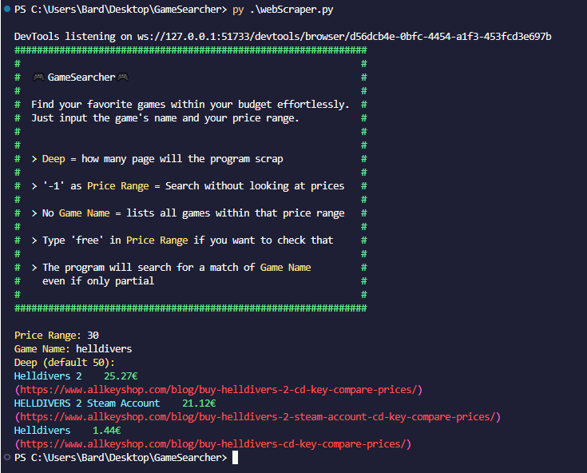
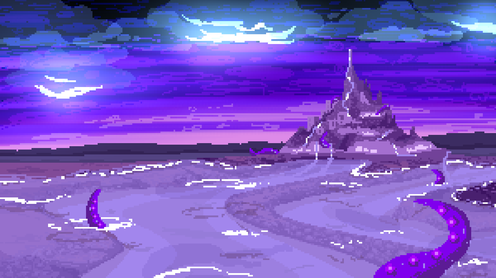
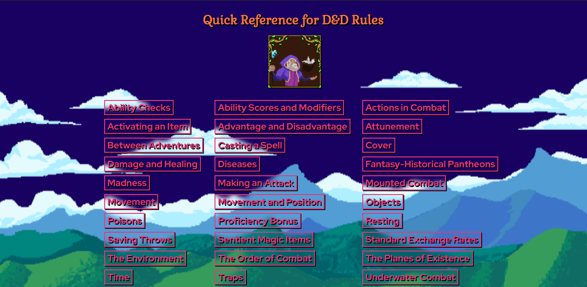

 

  
  
  

# Hello Folks! 
 <!-- Profile views -->
 
 
 
 
 
My name is Bard Sapio and I'm a C/C++ Developer.
  
  I'm from Italy, living in Florence and currently studying Computer Science.
  
<!--   I am motivated by the power of technology as a tool for positive change, with a background in Math, Physics, and Engineering. -->

<!-- See [my website](https://rahulkarda.netlify.app) for more information!    
You can also find me on [![Twitter][1.2]][1],  or on [![LinkedIn][3.2]][3].
website -->

🌱 I’m currently learning Unity

👯 I’m looking to collaborate on different projects

👨‍💻 All of my projects are available at this GitHub page

👀 Ask me about GAMES

📫You can reach me at sapiobard@gmail.com

⚡ Fun fact  - I like staring at blank walls

 

 
# Projects ⚙️
<table bordercolor="#66b2b2">
  
  <tr>
    <td width="50%" valign="top">
      <h3 align="center">Cub3d</h3>
         
        
         
        

           
  
      

        
<strong>C</strong> - cub3d:  A raycaster made in C language only, with a custom graphic library

    </td>
    <td width="50%" valign="top">
      <h3 align="center">GameSearcher</h3>
         
      
         
        

    
   
      

        
<strong>Python, Selenium</strong> - Game Searcher: a simple web scraper for AllKeyShop made with selenium driver

    </td>
  </tr>
  
  <tr>
    <td width="50%" valign="top">
      <h3 align="center">Counterphobia</h3>
       
          
       
        

           
  
      

        
<strong>GdScript (Python), Godot</strong> - Turn-based rpg that my team made for Roguelike Jam 7

    <td width="50%" valign="top">
      <h3 align="center">Minishell</h3>
         
        

           
  
      

        
<strong>C</strong> - Capstone Project for 42School, It's a light version of bash

    </td>
  </tr>

  <tr>
    <td width="50%" valign="top">
      <h3 align="center">Cinnamonblog</h3>
         
        
         
        

           
  <a href="https://github.com/Bardolomeo/CinnamonBlog" target="_blank">
    
  
      

        
<strong>Ejs, Node</strong> - Cinnamonblog:  Blog site made as practice project with node and ejs

    </td>
    <td width="50%" valign="top">
      <h3 align="center">D&D quick reference guide</h3>
         
      
         
        

    
  <a href="https://github.com/Bardolomeo/D-D_quick_reference" target="_blank">
    
   
      

        
<strong>Ejs, Node, Axios</strong> - D&D Quick Reference: study project made to test out APIs, credits to D&D 5E API

    </td>
  </tr>
</table>

  

<!-- default README.md -->
<!--
- 👋 Hi, I’m Rahul Karda
- 👀 I’m interested in Full Stack Web Development and other skills
- 🌱 I’m currently learning React
- 💞️ I’m looking to collaborate on different web dev projects
- 📫 How to reach me - You can contact me on rahulkarda2002@gmail.com
-->
